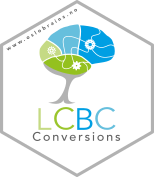

<!-- README.md is generated from README.Rmd. Please edit that file -->

# LCBC Conversions 

The repository contains functions to run coversions on certain raw data
in the database of LCBC.

The conversions covered so far:

  - IQ measures - conversions from raw to T, scaled and fullscale IQ
    scores  
  - MAP mean - blood pressure conversion

Vignettes are on their way.
